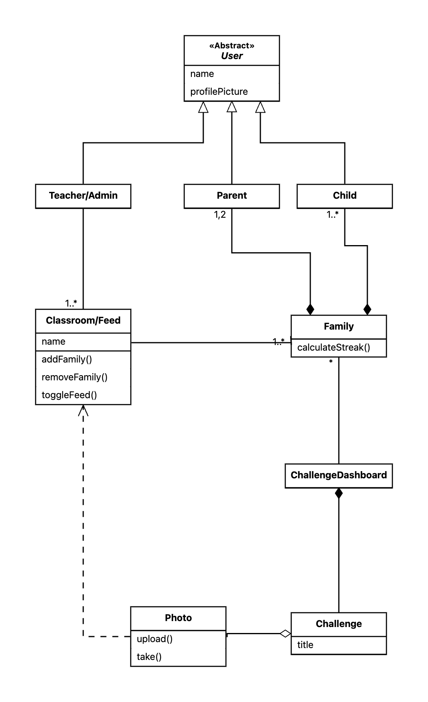

# DigitalBalanceAtHome

## Project Documentation

This README serves as your primary documentation. **Fill out each section carefully** — vague or generic content will not be accepted. Each section below contains guidance in blockquotes (>) with examples. **Replace all blockquotes with your own content.**

### Problem Statement (max. 500 words)

> TODO: Add your problem statement here.

### Requirements

#### Functional Requirements (User Stories)

> TODO: List the user stories that your app fulfills. These should be added to the GitLab product backlog as issues. Discuss and refine them with your tutor.

- As a [user], I want to [action] so that [goal].

**Example** (for an Expense Tracking App): As a [student], I want to [see all my monthly transactions] so that [I can make better financial decisions].

#### Quality Attributes & External Constraints

> TODO: For **each** required quality attribute or constraint listed below, replace the placeholder with a **specific** description of how **your app** addresses it. You must name the **exact files, views, frameworks, or services** you used — generic statements like "followed Apple guidelines" or "used native components" are not sufficient.

Each subsection below must include:
1. **What you did** — the specific implementation (name the view, file, framework, or service)
2. **Where to find it** — a link to the file or a screenshot
3. **Any follow-up work** — what you would improve with more time

---

##### Human Interface Guidelines (HIG)

> TODO: Describe **specific** HIG decisions you made. Do not write "I followed Apple's HIG."
>
> **Good example:**
> - Navigation uses `NavigationStack` with a tab bar (`TabView`) for the three main sections (Expenses, Budget, Settings) — see `MainTabView.swift`
> - All icons are SF Symbols (`chart.bar.fill`, `gearshape`) to match iOS conventions
> - Touch targets are at least 44×44pt; spacing follows 8pt grid — see `ExpenseRowView.swift`
> - Destructive actions (delete expense) use `.destructive` role with a confirmation dialog — see `ExpenseDetailView.swift`
>
> **Bad example** (do not do this):
> - "I followed Apple's Human Interface Guidelines to make the app intuitive and visually consistent with iOS design."

##### Dark Mode

> TODO: Explain how your app supports dark mode. Name the specific approach.
>
> **Good example:**
> - All colors use semantic system colors (`Color.primary`, `Color(.systemBackground)`) — no hardcoded hex values
> - Custom accent color defined in `Assets.xcassets/AccentColor` with light/dark variants
> - Verified in Simulator by toggling Appearance in Settings — screenshot below:
>   
>
> **Bad example:** "My app supports dark mode."

##### Persistence

> TODO: Explain what data your app persists and how.
>
> **Good example:**
> - User expenses are stored using SwiftData with a `@Model` class `Expense` in `Models/Expense.swift`
> - The model container is injected at the app root in `ExpenseTrackerApp.swift`
> - Data survives app restarts — verified by adding an expense, force-quitting, and relaunching

##### Responsiveness

> TODO: Explain how your app stays responsive during long-running operations.
>
> **Good example:**
> - Network requests to the exchange-rate API use `async/await` in `ExchangeRateService.swift` so the UI never freezes
> - A `ProgressView` is shown while loading data — see `DashboardView.swift:42`

##### Error Handling

> TODO: Explain how your app handles errors.
>
> **Good example:**
> - Network errors are caught in `ExchangeRateService.swift` and surfaced to the user via an `.alert` modifier in `DashboardView.swift`
> - If the API is unreachable, the app shows cached data with a banner "Showing offline data" — see `OfflineBanner.swift`

##### Logging

> TODO: Explain how your app uses logging.
>
> **Good example:**
> - Using `os.Logger` with a subsystem matching my bundle identifier (e.g., `de.tum.cit.ase.ios26.ExpenseTracker`) and categories per feature (e.g., `Logger(subsystem:category:)` for "Networking", "Persistence")
> - Key events logged: API call start/success/failure in `ExchangeRateService.swift`, SwiftData save errors in `Expense.swift`

#### Glossary (Abbott's Analysis)

> TODO: Define key terms and concepts used in your project. Clarify domain-specific language or abbreviations.

| Term | Definition |
| ---- | ---------- |
| *example:* Transaction | A record of money moving out of an account in exchange for a product or service. |
| ... | ... |

#### Analysis Object Model

> TODO: Add an analysis object model diagram showing relationships between key entities in your app.

* **Instructions:** Create with [Apollon](https://apollon.aet.cit.tum.de) or the [Apollon VS Code extension](https://marketplace.visualstudio.com/items?itemName=aet-tum.apollon-extension), export as a **PNG or JPEG** and insert it directly (no links, **no SVG**).

<!-- Replace the path below with the actual path to your exported AOM image -->

### Architecture

#### Subsystem Decomposition

> TODO: Break down your app into its main subsystems (e.g., UI layer, networking, data/persistence, domain/logic, feature modules). Describe responsibilities, main data flows, and key dependencies. Include a diagram.

* **Instructions:** Create a UML component diagram with [Apollon](https://apollon.aet.cit.tum.de) or the [Apollon VS Code extension](https://marketplace.visualstudio.com/items?itemName=aet-tum.apollon-extension), export as a **PNG or JPEG** (not SVG) and insert it below.

<!-- Replace the path below with the actual path to your exported subsystem decomposition image -->

* Subsystem A — responsibilities, key types, inbound/outbound data
* Subsystem B — ...
* ...

---

*Replace all TODOs and keep this document current. It is both your planning guide and part of your final deliverable.*

