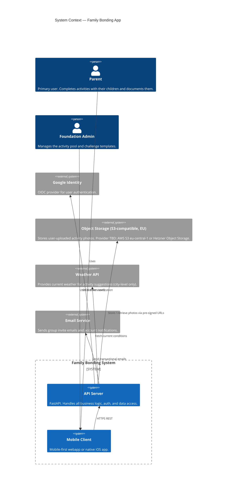
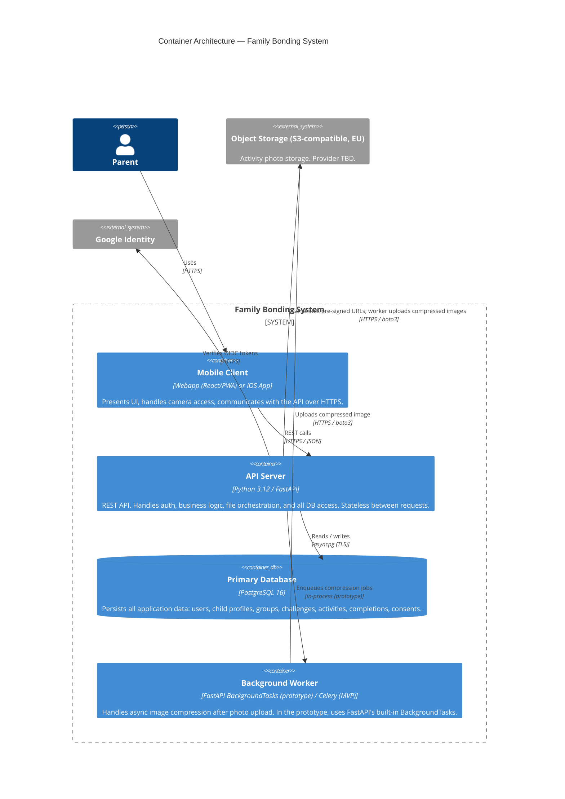
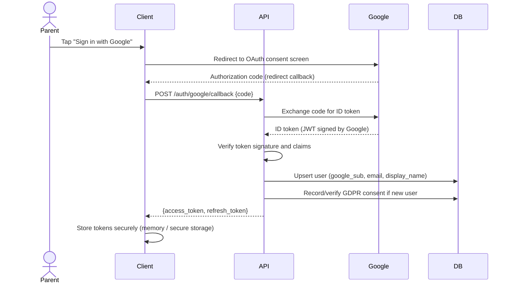
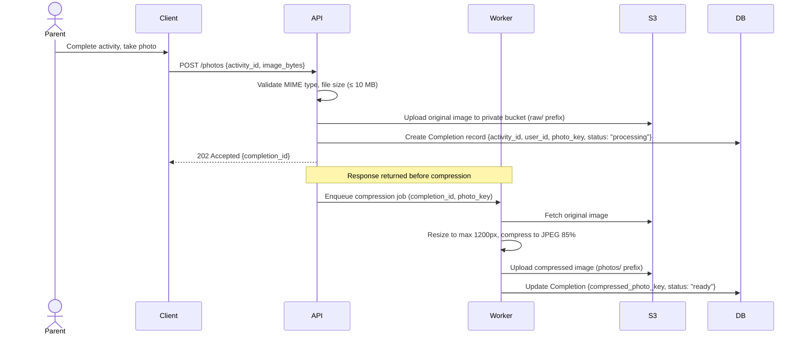
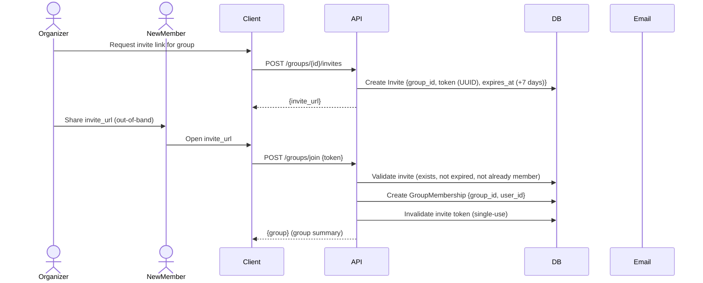
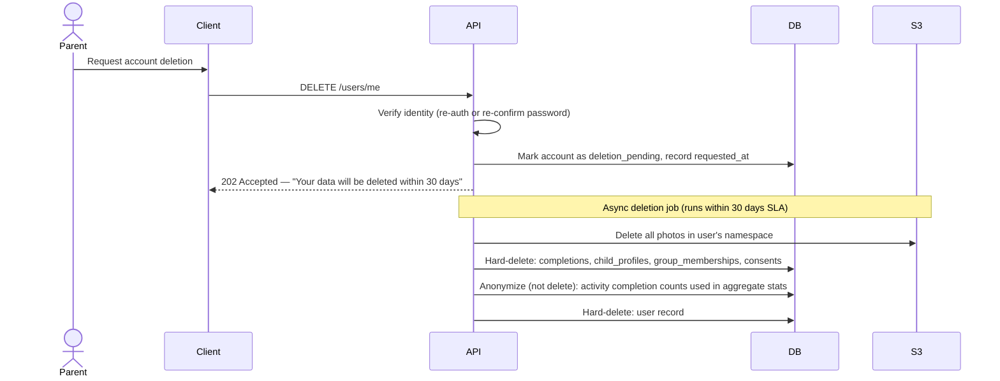

# System Architecture Document
**Project:** Family Bonding Activity App  
**Version:** 0.1  
**Date:** 2026-05-21  
**Status:** Draft

---

## Table of Contents

1. [Purpose and Scope](#1-purpose-and-scope)
2. [Architectural Goals and Constraints](#2-architectural-goals-and-constraints)
3. [System Context](#3-system-context)
4. [Container Architecture](#4-container-architecture)
5. [Component Architecture — API Server](#5-component-architecture--api-server)
6. [Key Flows](#6-key-flows)
7. [Data Layer](#7-data-layer)
8. [External Integrations](#8-external-integrations)
9. [Deployment Topology](#9-deployment-topology)
10. [Security Architecture](#10-security-architecture)
11. [Scalability Path](#11-scalability-path)
12. [Technology Decision Log](#12-technology-decision-log)

---

## 1. Purpose and Scope

This document describes the architecture of the Family Bonding Activity App at the prototype stage. It covers the two deployable components — the FastAPI backend server and the mobile client — their internal structure, the external services they depend on, and how the system is deployed. It is intended for the development team and serves as the reference for implementation decisions.

This document is architecture-level. It does not specify individual API endpoints or database schemas — those are covered in the API Design Document and Data Model respectively.

---

## 2. Architectural Goals and Constraints

### Goals

- **Simplicity first.** The prototype runs on a single server with Docker Compose. No orchestration, no microservices, no distributed state.
- **Horizontal scalability readiness.** The architecture avoids patterns that prevent future scaling (no in-memory sessions, no local filesystem state).
- **GDPR by design.** Data residency, consent, and erasure are architectural concerns, not afterthoughts.
- **Testability.** Business logic is isolated in a service layer; no logic in route handlers beyond HTTP concerns.
- **Observable.** Structured logs with request correlation IDs from day one.

### Constraints

- Single EU-based server for all compute (Docker Compose).
- Photo storage on an S3-compatible EU object storage provider (AWS S3 `eu-central-1` or Hetzner Object Storage — TBD). No data leaves the EU.
- No in-memory session state — the app must be stateless between requests.
- No third-party analytics or advertising SDKs in the client.
- Authentication is Google OAuth 2.0 (OIDC) only for the prototype. Email/password is deferred.

---

## 3. System Context

The diagram below shows the system boundary and all external actors and services the system interacts with.



### What is inside the system boundary

- The API server and all its business logic.
- The mobile client application.
- The PostgreSQL database (co-located on the same server in the prototype).

### What is outside the system boundary

- Google Identity Platform (authentication provider).
- S3-compatible object storage provider (AWS S3 `eu-central-1` or Hetzner Object Storage — TBD).
- A weather data provider (specific provider TBD; city-level granularity only).
- A transactional email provider (specific provider TBD; e.g., Postmark, AWS SES).
- The user's device and camera.

---

## 4. Container Architecture

A container in this context means a separately deployable/runnable unit (following C4 terminology), not necessarily a Docker container.



### Container responsibilities

**Mobile Client** handles all user-facing interactions. It never accesses the database or S3 directly — all operations go through the API. For photo uploads, the client POSTs the image bytes to the API, which handles storage. Pre-signed S3 URLs for photo retrieval are returned by the API and used directly by the client to load images without proxying through the server.

**API Server** is the single backend process. It is stateless — every request carries its own auth context (JWT) and the server derives everything else from the database. It owns all business logic and is the only component allowed to write to the database.

**PostgreSQL** is the single source of truth for all application state. It runs in the same Docker Compose stack in the prototype.

**Background Worker** runs image compression asynchronously so that photo upload responses are returned immediately to the client. In the prototype this uses FastAPI's `BackgroundTasks`. In a future phase this becomes a Celery worker with a Redis broker to allow horizontal scaling.

---

## 5. Component Architecture — API Server

The API server is structured in four horizontal layers. Dependencies flow strictly downward: routes → services → repositories → database. No layer may import from a layer above it.

```
┌──────────────────────────────────────────────────────┐
│                     API Layer                        │
│  FastAPI routers — HTTP concerns only                │
│  Input validation (Pydantic), response serialization │
│  Auth dependency injection                           │
├──────────────────────────────────────────────────────┤
│                   Service Layer                      │
│  Business logic, orchestration, domain rules         │
│  Calls one or more repositories                      │
│  Raises domain exceptions; never raises HTTPException│
├──────────────────────────────────────────────────────┤
│                 Repository Layer                     │
│  Data access only — no business logic                │
│  Wraps SQLAlchemy queries                            │
│  One repository class per aggregate root             │
├──────────────────────────────────────────────────────┤
│                   Data Layer                         │
│  SQLAlchemy async ORM models                         │
│  Alembic migrations                                  │
│  asyncpg driver → PostgreSQL                         │
└──────────────────────────────────────────────────────┘
```

### Module map

```
app/
├── main.py               App factory, middleware, lifespan hooks
├── api/                  Routers (one file per resource group)
│   ├── health.py         /healthz, /readyz
│   ├── auth.py           /auth/google/callback, /auth/refresh, /auth/logout
│   ├── users.py          /users/me, /users/me/delete
│   ├── children.py       /children (CRUD)
│   ├── activities.py     /activities (pool browsing, suggestions)
│   ├── challenges.py     /challenges (CRUD, collage state)
│   ├── groups.py         /groups (CRUD, invites, membership)
│   └── photos.py         /photos (upload, retrieve URL)
├── core/
│   ├── config.py         pydantic-settings Settings
│   ├── database.py       Async engine, session factory, Base
│   ├── logging.py        structlog configuration
│   └── security.py       JWT encode/decode, token helpers
├── dependencies/
│   ├── auth.py           get_current_user (FastAPI Depends)
│   └── database.py       get_db (FastAPI Depends)
├── models/               SQLAlchemy ORM models
│   ├── base.py           TimestampMixin (id, created_at, updated_at)
│   ├── user.py
│   ├── child_profile.py
│   ├── activity.py
│   ├── challenge.py
│   ├── group.py
│   ├── completion.py
│   └── consent.py
├── schemas/              Pydantic v2 request/response schemas
│   ├── common.py         Shared: ErrorResponse, PaginatedResponse
│   ├── auth.py
│   ├── user.py
│   ├── child_profile.py
│   ├── activity.py
│   ├── challenge.py
│   ├── group.py
│   └── completion.py
├── repositories/
│   ├── base.py           Generic async CRUD base
│   ├── user.py
│   ├── activity.py
│   ├── challenge.py
│   ├── group.py
│   └── completion.py
└── services/
    ├── auth.py           OAuth exchange, token lifecycle
    ├── activity.py       Filtering, suggestions
    ├── challenge.py      Challenge state, collage assembly
    ├── group.py          Invite logic, membership rules
    ├── photo.py          Upload orchestration, S3 pre-signed URL generation
    └── erasure.py        GDPR account deletion, cascading data removal
```

### Key architectural rules

- **Route handlers do not contain business logic.** They validate input (via Pydantic), call one service method, and return a response.
- **Services do not raise `HTTPException`.** They raise domain-specific exceptions (e.g., `GroupNotFound`, `InviteExpired`) that are caught and translated by a global exception handler.
- **Repositories do not enforce business rules.** A repository method that fetches a group by ID does not check whether the requesting user is a member — that is a service concern.
- **Schemas and models are strictly separated.** A SQLAlchemy model is never returned directly from a route. A Pydantic schema is never passed into a repository.

---

## 6. Key Flows

### 6.1 Authentication (Google OAuth 2.0 OIDC)



Tokens are never stored in the database. The refresh token is opaque to the client — the server encodes the user ID and expiry into it as a signed JWT.

---

### 6.2 Photo Upload and Async Compression



The client polls `GET /completions/{id}` or (in a future phase) receives a push notification when the status transitions to `"ready"`. The raw original is deleted from S3 after successful compression.

---

### 6.3 Group Invite Flow



Invite tokens are single-use and expire after 7 days. A group admin can revoke outstanding invites at any time.

---

### 6.4 GDPR Right-to-Erasure Flow



The 30-day window exists to allow the user to cancel if the request was made in error. After the window, deletion is irreversible. Aggregated statistics that cannot be linked back to the individual (e.g., total activity completions per challenge) are retained.

---

## 7. Data Layer

### 7.1 Database

PostgreSQL 16 is the primary data store. All reads and writes go through the async SQLAlchemy ORM using the `asyncpg` driver.

**Core entities and relationships (conceptual):**

```
User ──< ChildProfile
User ──< GroupMembership >── Group
Group ──< Challenge
Challenge ──< ChallengeActivity >── Activity
User ──< Completion >── ChallengeActivity
Completion ──○ Photo
User ──< ConsentRecord
Group ──< Invite
```

**Key design decisions:**

- All primary keys are UUIDs (`gen_random_uuid()`), never sequential integers. This prevents enumeration attacks and simplifies future data merges.
- All timestamps are stored in UTC with timezone awareness (`TIMESTAMPTZ`).
- Soft deletes are not used. All deletions are hard deletes, which simplifies GDPR erasure. Audit trails where needed use append-only event records.
- Child profiles store date of birth, not age. Age is derived at query time to remain accurate without updates.

### 7.2 Photo Storage (S3-compatible object storage, EU)

**Provider:** TBD — AWS S3 `eu-central-1` or Hetzner Object Storage. Both are S3-compatible and EU-hosted; `boto3` works with either by changing the endpoint URL and credentials. The decision does not affect application code.

Photos are never served through the API server. The flow is:

1. Client uploads the image to the API, which stores it in the object store.
2. When the client needs to display a photo, it requests a pre-signed URL from the API (`GET /photos/{id}/url`).
3. The API generates a pre-signed GET URL valid for 15 minutes and returns it.
4. The client loads the image directly from the object store using that URL.

**Bucket structure:**

```
bonding-photos-prod/
├── raw/{user_id}/{completion_id}.jpg      ← original upload, deleted after compression
└── photos/{user_id}/{completion_id}.jpg   ← compressed, served to clients
```

The bucket is private. No public access. All objects are encrypted at rest. The API authenticates using an access key pair scoped to the minimum required operations (`PutObject`, `GetObject`, `DeleteObject`) on this bucket only.

### 7.3 Migrations

All schema changes are managed with Alembic. No schema modifications are ever made directly on the database. The migration sequence is:

1. Developer writes a new migration file locally.
2. CI runs `alembic upgrade head` against a test database to validate the migration.
3. On deployment, the Docker Compose entrypoint runs `alembic upgrade head` before starting the API server.

---

## 8. External Integrations

| Service | Purpose | Integration method | Data sent | EU residency |
|---|---|---|---|---|
| Google Identity | OIDC authentication | HTTPS token exchange | Authorization code; receives ID token | No personal data stored externally |
| Object storage — TBD: AWS S3 eu-central-1 or Hetzner | Photo storage | boto3 (S3-compatible) | JPEG photo bytes | ✅ EU-hosted |
| Weather API (TBD) | Activity suggestions | HTTPS REST | City name or postal code (no precise GPS) | TBD — must confirm EU compliance |
| Email service (TBD) | Invites, account notifications | HTTPS REST / SMTP | Email address, name, invite URL | TBD — must be EU-hosted or have a DPA |

> **Note:** A Data Processing Agreement must be established with all services in this table before any real user data is processed. The weather and email providers are TBD and must be evaluated against GDPR requirements before selection.

---

## 9. Deployment Topology

### Prototype (current)

A single EU-based server running all components via Docker Compose. Simple, cheap, easy to debug.

```
┌─────────────────────────────────────────────────────┐
│                  EU Server (Hetzner / similar)       │
│                                                     │
│  ┌──────────────┐    ┌──────────────────────────┐   │
│  │    Caddy     │    │       docker-compose      │   │
│  │ (TLS termination, │                          │   │
│  │  reverse proxy)│  │  ┌────────────────────┐  │   │
│  │              │───┼─▶│    api (FastAPI)    │  │   │
│  └──────────────┘   │  │    :8000            │  │   │
│                     │  └────────┬───────────┘  │   │
│  Port 443 (HTTPS)   │           │               │   │
│  Port 80 (redirect) │  ┌────────▼───────────┐  │   │
│                     │  │   db (PostgreSQL)   │  │   │
│                     │  │   :5432             │  │   │
│                     │  └────────────────────┘  │   │
│                     └──────────────────────────┘   │
│                                                     │
│  Volumes: postgres_data (named), ./caddy/           │
└─────────────────────────────────────────────────────┘
                              │
              ┌───────────────┼───────────────┐
              ▼               ▼               ▼
     Object Storage   Google Identity   Weather API
    (AWS / Hetzner)     (external)       (external)
```

**Caddy** sits in front of the API and handles TLS termination, automatic certificate renewal (Let's Encrypt), and reverse proxying. It is not part of the application — it is infrastructure.

**Deployment process** (on every merge to `main`):
1. GitHub Actions builds and pushes a new Docker image to `ghcr.io`.
2. A deploy job SSHes into the server and runs `docker compose pull && docker compose up -d --remove-orphans`.
3. The API container starts by running `alembic upgrade head`, then starts uvicorn.

### Future — MVP (not in scope for prototype)

When the user base grows, the architecture can evolve without structural changes to the API:

- Database → managed Postgres (e.g., RDS `eu-central-1` or Hetzner Managed DB).
- Background worker → separate Celery container with Redis broker.
- Multiple API replicas behind a load balancer (possible because the API is stateless).

---

## 10. Security Architecture

### Authentication and authorization

- Authentication is handled exclusively via Google OIDC. The API verifies the ID token signature against Google's public keys (`https://www.googleapis.com/oauth2/v3/certs`).
- After verification, the API issues its own short-lived JWT access token (15 min) and a refresh token (7 days, rotated on use).
- Every protected endpoint uses the `get_current_user` dependency, which validates the JWT and extracts the user ID.
- Authorization (what the authenticated user is allowed to do) is enforced in the service layer. For example, a user may only read photos belonging to groups they are a member of.

### Transport security

- All external traffic is HTTPS (TLS 1.2+), enforced by Caddy.
- The PostgreSQL connection uses TLS in production.
- The API never communicates over plain HTTP in staging or production.

### Photo access control

- The S3 bucket is private. No object is publicly accessible.
- Photos are accessed via pre-signed URLs with a 15-minute TTL.
- The API validates group membership before issuing a pre-signed URL for a photo.
- Child photos are never accessible outside the parent's groups, even via direct URL guessing (pre-signed URLs embed the user scope in the key path).

### Input validation

- All request bodies are validated by Pydantic v2 before reaching service code.
- File uploads validate MIME type and size before any processing.
- The database is accessed exclusively via SQLAlchemy parameterized queries — no raw SQL string interpolation.

### Rate limiting

- Authentication endpoints are rate-limited to 10 requests per IP per minute (enforced by a middleware using a sliding-window counter stored in the database or a simple in-process counter for the prototype).
- In a future phase, a Redis-backed rate limiter replaces the in-process one.

### Secrets management

- All secrets (JWT key, Google client credentials, object storage access keys) are environment variables injected at runtime.
- Secrets are stored as GitHub Actions repository secrets and never committed to the repository.
- The `.env` file is in `.gitignore`.

---

## 11. Scalability Path

The prototype is deliberately simple, but the architecture avoids patterns that would require rewriting to scale:

| Constraint | How it is avoided |
|---|---|
| In-memory session state | All state is in PostgreSQL. Any replica can serve any request. |
| Local filesystem for photos | Photos go to S3, not the server's disk. |
| Synchronous image processing blocking the web worker | Handled in `BackgroundTasks` (in-process async, prototype) → Celery worker (MVP). |
| Single point of failure for the DB | Prototype accepts this. MVP moves to managed Postgres with failover. |
| Hardcoded infrastructure URLs | All config via `pydantic-settings`; no code changes needed to point at a different DB or bucket. |

---

## 12. Technology Decision Log

| Decision | Choice | Alternatives considered | Rationale |
|---|---|---|---|
| Backend framework | FastAPI | Django REST Framework, Flask | Native async, automatic OpenAPI generation, Pydantic v2 integration, strong typing. |
| ORM | SQLAlchemy 2.x async | Django ORM, Tortoise ORM | Most mature async ORM; wide ecosystem; supports Alembic natively. |
| Database | PostgreSQL 16 | MySQL, SQLite | Best JSON support, UUID functions, full ACID compliance, GDPR-friendly extension ecosystem. |
| Auth provider | Google OIDC | Auth0, Keycloak, custom | Zero credential management for the prototype; widely trusted by parents; free tier sufficient. |
| Object storage | **TBD:** AWS S3 eu-central-1 or Hetzner Object Storage | Scaleway | Both are S3-compatible, EU-hosted, and work with boto3 via endpoint override — no code change required to switch. AWS has more mature tooling and a larger SDK ecosystem; Hetzner is significantly cheaper and consolidates infrastructure with the compute server. Decision pending. |
| Background tasks | FastAPI BackgroundTasks (prototype) | Celery + Redis | Sufficient for prototype scale; no extra infrastructure. Celery is the clear upgrade path. |
| Deployment | Docker Compose, single server | Kubernetes, ECS | Appropriate complexity for prototype; team familiarity; easy to debug; upgrade path is clear. |
| TLS / reverse proxy | Caddy | nginx, Traefik | Automatic certificate renewal; zero-config HTTPS; simpler config than nginx. |
| Linter / formatter | ruff | black + flake8 + isort | Single tool replacing three; significantly faster; actively maintained. |
| Python version | 3.12 | 3.11 | Latest stable; improved async performance; better error messages. |
