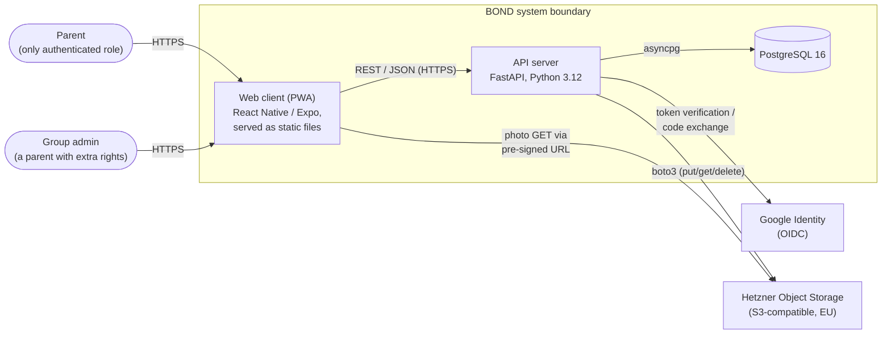
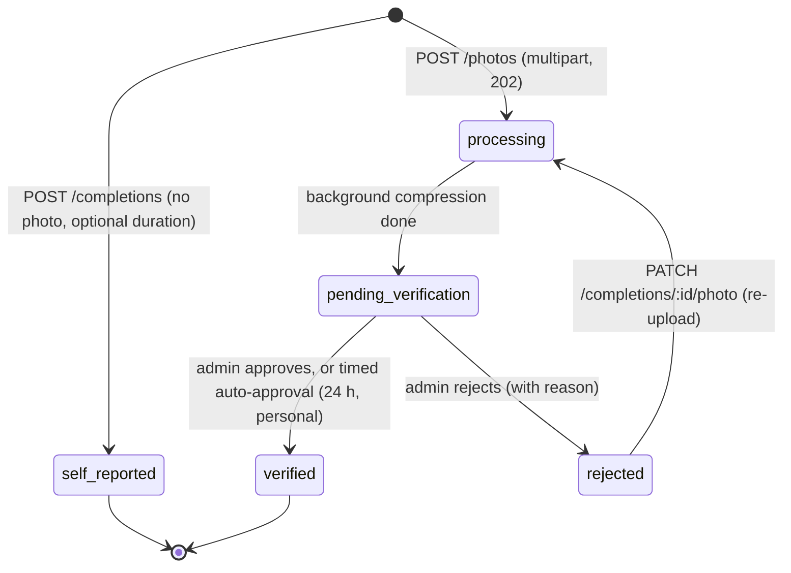
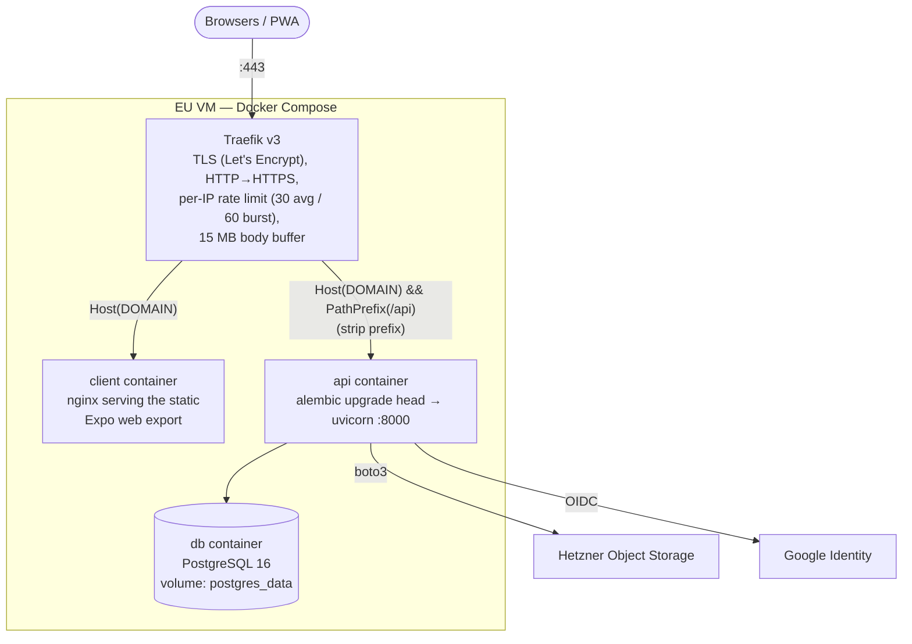
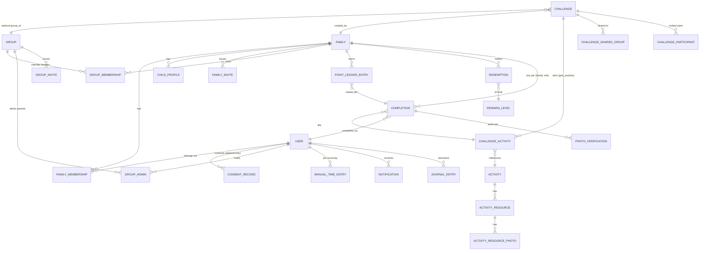

# BOND — Technical Documentation

**Project:** DigitalBalance @home ("BOND")
**Context:** TUM Healthcare Innovation Program, Challenge #6 — SoSe 2026, in partnership with [Stiftung Kindergesundheit](https://www.kindergesundheit.de/)
**Date:** 2026-07-16
**Status:** Course deliverable — describes the system **as built** at commit `b3a199a`
**License:** MIT

---

## About This Document

This document is the single, authoritative technical description of the BOND prototype. It is structured after the [arc42](https://arc42.org/overview) architecture documentation template (sections 1–12) and applies the [Diátaxis](https://diataxis.fr/) framework for the appendices: **reference** material (API, database, configuration) is kept separate from **how-to** material (developer guide) and **explanation** (the numbered sections).

Two things distinguish it from the planning documents that preceded it (`docs/requirements.md`, `docs/implementation-plan.md`, and the since-deleted early architecture draft):

1. **It documents the system as it actually exists**, not as it was planned. Where the implementation diverged from early drafts (e.g., Traefik instead of Caddy, challenges without dates, a days-based streak), this document states the current truth and Section 9 records the decision.
2. **It covers everything built after the original milestone plan** — the progress/streak system, the points and rewards system with photo verification, time-spent insights, interest registration, activity resources, and localization — which exist only as separate feature specs (`specs/001`–`specs/005`) elsewhere.

**Naming note:** the project was commissioned as *DigitalBalance @home*; the product brand chosen during the business-model phase is **BOND**. The app displays "Bond"; the repository and internal identifiers still use `digital-balance-at-home` / `digitalbalance`. Both names refer to the same system.

---

## Table of Contents

1. [Introduction and Goals](#1-introduction-and-goals)
2. [Constraints](#2-constraints)
3. [System Context and Scope](#3-system-context-and-scope)
4. [Solution Strategy](#4-solution-strategy)
5. [Building Block View](#5-building-block-view)
6. [Runtime View](#6-runtime-view)
7. [Deployment View](#7-deployment-view)
8. [Crosscutting Concepts](#8-crosscutting-concepts)
9. [Architecture Decision Log](#9-architecture-decision-log)
10. [Quality Requirements](#10-quality-requirements)
11. [Risks and Technical Debt](#11-risks-and-technical-debt)
12. [Glossary](#12-glossary)

**Appendices (reference and how-to):**

- [Appendix A — API Reference](#appendix-a--api-reference)
- [Appendix B — Database Schema Reference](#appendix-b--database-schema-reference)
- [Appendix C — Configuration Reference](#appendix-c--configuration-reference)
- [Appendix D — Developer Guide](#appendix-d--developer-guide)
- [Appendix E — Requirements Traceability](#appendix-e--requirements-traceability)
- [Appendix F — Source Documents](#appendix-f--source-documents)

---

## 1. Introduction and Goals

### 1.1 Problem

Digital media shapes family life constantly and often unconsciously, reducing emotional presence and weakening parent–child connections. Interventions built on negative reinforcement — screen-time blockers, usage statistics, guilt — have proven ineffective at changing parental behaviour. The project's founding hypothesis: **digital resilience doesn't start with children; it starts with parents**, and the effective lever is giving families something concrete and rewarding to do together, not telling them to stop doing something.

### 1.2 The Product

BOND is a family activity challenge platform. Parents join invite-only **groups** (e.g., their child's KITA class) and participate in **challenges** — curated sets of offline activities. Each completed activity is documented with a photo that fills a slot in a shared **collage**: a growing memory album that doubles as a progress indicator. Around this core loop the prototype adds:

- **Streaks and weekly goals** — a family-level "days active" streak with an automatic one-day freeze, and a weekly goal ring on the home screen.
- **Points and reward levels** — photo-verified completions earn fixed-tier points on a quarterly family balance, unlocking four reward levels (the BOND business model's milestone ladder).
- **Photo verification** — group-challenge photos are reviewed by a group admin; personal-challenge photos auto-approve after a timed window.
- **Time-spent insights** — a private, per-parent chart combining activity durations with manually logged offline time.
- **Activity resources** — links, notes, and photos attached to activities to remove preparation overhead (e.g., the cookie recipe attached to the baking activity).
- **Localization** — full German/English UI and content localization.

### 1.3 Quality Goals

The five quality goals that shaped the architecture, in priority order:

| # | Quality goal | What it means concretely |
|---|---|---|
| 1 | **GDPR by design** | EU-only data residency, granular versioned consent, hard deletes, right to erasure with a 30-day window, data export, no third-party analytics, no precise GPS. |
| 2 | **Psychological safety** | No leaderboards or per-family rankings; aggregate group progress only; positive framing everywhere; sharing is opt-in per completion. Enforced in the service layer, not just the UI. |
| 3 | **Simplicity with a scaling path** | Single-server Docker Compose deployment, but stateless API, S3 object storage, and no in-memory sessions — nothing structurally prevents horizontal scaling later. |
| 4 | **Testability** | Strict route → service → repository layering; business logic never lives in route handlers; 266 automated backend tests run in CI. |
| 5 | **Contract fidelity** | `docs/openapi.yaml` is the authoritative API contract; server schemas are generated from it, never hand-written. |

### 1.4 Stakeholders

| Stakeholder | Role | Expectation of the architecture |
|---|---|---|
| Parents | Primary (and only) authenticated users | Low-friction onboarding, fast photo upload, trustworthy handling of children's photos |
| Children | Indirect beneficiaries; represented by profiles, never accounts | Their data never leaves the family's chosen groups |
| Stiftung Kindergesundheit | Client / product owner | Mission alignment, data ethics, a credible path from prototype to institutional product |
| KITA staff / teachers | Group admins | Simple group management: invite link, member list, photo review queue |
| Partner organizations | Future reward/marketplace providers | Clean extension points (marketplace tier, partner content flag exist; fulfillment does not) |
| Development team / course evaluators | Builders and assessors | Clear structure, reproducible setup, documented decisions |

### 1.5 Functional Scope

The full requirements catalogue lives in `docs/requirements.md` (FR-001…FR-112, NFR-001…NFR-061). The prototype implements, end to end:

- Google sign-in with JWT session management (FR-002–004)
- Onboarding: welcome → granular GDPR consent → family setup → child profile with interest picker → weekly goal
- Families with invite links; children belong to the family, not to an individual parent
- Groups of families with invite links, per-parent admin rights, and a shared feed
- A curated, localized activity pool (30 seed activities) plus user-created custom activities with resources
- Challenges (group, personal, or shared/participant-based) rendered as photo collages, including preset collages
- Photo completions with async compression, verification states, re-upload after rejection, and self-reported (photoless) completions with duration capture
- Points, reward levels, redemptions, and a group-admin verification queue
- Streaks, weekly goals, family progress dashboard, and private time-spent insights
- Group feed with opt-in sharing; friends list; challenge-invite notifications
- GDPR self-service: consent records, data export, account deletion with cancel window
- Full German/English localization of UI and content

Explicitly **not** implemented (placeholder or deferred): real reward fulfillment and voucher inventory, marketplace booking/payments, AI photo validation, push notifications, the weather API integration (suggestions fall back to season/age rules), board-game display mode, and the mood journal (built, then deliberately phased out of the UI — see §9, D-14).

---

## 2. Constraints

### 2.1 Regulatory and Organizational

| Constraint | Consequence |
|---|---|
| GDPR compliance mandatory from day one | Consent gate before any data entry; append-only `consent_records` with policy version; hard deletes only (no soft-delete flags); erasure and export endpoints; EU-only hosting |
| Children are data subjects but not users | `ChildProfile` has no credentials; child data never appears in any group-visible API response |
| Target cohort: German-speaking parents, children ~3–12 | German is the default content language; English added as second language |
| Course/prototype budget and timeline | Single VM, Docker Compose, no managed services beyond object storage; free-tier Google OAuth |
| Foundation's design ethics | No competitive comparison, no negative framing, no paid activities as primary suggestions, socioeconomic accessibility of activities |

### 2.2 Technical

| Constraint | Consequence |
|---|---|
| Single EU server for all compute | Docker Compose topology; background work runs in-process (asyncio), not in separate workers |
| No in-memory session state | JWTs carry auth context; any future replica could serve any request |
| Photos must not transit or rest outside the EU | Hetzner Object Storage (S3-compatible, EU); private bucket; pre-signed URLs |
| No third-party analytics/advertising SDKs in the client | None present; the only external client-side calls are to Google OAuth and the API |
| Primary client target is **web** (PWA) | Expo web build served as static files; native-only libraries avoided or replaced (see §9, D-6) |

### 2.3 Conventions

- **Spec first:** any endpoint/field change starts in `docs/openapi.yaml`; `server/app/schemas/generated.py` is regenerated, never edited.
- **Layering:** routes → services → repositories → database; dependencies point downward only.
- **Python:** ruff (lint + format) and mypy, enforced by pre-commit and CI. **TypeScript:** `tsc --noEmit` and `expo lint`.
- All primary keys are UUIDs; all timestamps are `TIMESTAMPTZ` in UTC.
- Feature work beyond the original plan follows the [Spec Kit](https://github.com/github/spec-kit) workflow: each feature has `spec.md`, `plan.md`, `research.md`, `data-model.md`, `tasks.md` under `specs/NNN-name/`.

---

## 3. System Context and Scope



### External systems

| System | Purpose | Data exchanged | Residency |
|---|---|---|---|
| Google Identity | Authentication (OIDC). Two flows: ID-token verification (web), authorization-code + PKCE exchange (native) | ID token / auth code; Google returns `sub`, email, name | No BOND data stored at Google |
| Hetzner Object Storage | All photo storage: completion photos, avatars, activity-resource photos | JPEG bytes; private bucket; 15-minute pre-signed GET URLs | EU (Germany/Finland) |
| Let's Encrypt | TLS certificates, automated by Traefik | ACME HTTP challenge | — |
| GitHub (Actions + GHCR) | CI, image build, deployment trigger | Source, Docker images, deploy secrets | Build-time only |

Systems that appear in early planning but were **never integrated**: a weather API (suggestions use season + age + interests instead) and a transactional email service (invites are shared as links via the OS share sheet/clipboard).

---

## 4. Solution Strategy

The architecture in six decisions (details and alternatives in §9):

1. **Monorepo, two deployables.** One repository holds the Expo client, the FastAPI server, the API contract, all specs, and the deployment definitions — matching a small team where every feature ships client and server together.
2. **Spec-driven API.** `docs/openapi.yaml` (~3,300 lines, 60+ operations) is written first; `datamodel-codegen` generates all Pydantic response/request models. The server cannot drift from the contract without the diff showing in the spec.
3. **Strictly layered, stateless server.** Four layers with downward-only dependencies. Domain exceptions (never `HTTPException`) from services, translated by global handlers into a uniform `{detail, code}` error body. JWTs make the API stateless.
4. **Derived state over stored state.** Collages, challenge status (`active` until every slot is filled), streak displays, points balances, and progress metrics are computed at query time from ground-truth rows (completions, ledger entries) rather than maintained as denormalized state.
5. **In-process asynchrony with self-healing.** Photo compression runs in FastAPI `BackgroundTasks`; three asyncio loops (streak freeze, timed auto-approval, photo recovery) provide scheduled work without any queue infrastructure. A recovery sweeper makes the photo pipeline crash-tolerant despite being in-process.
6. **Web-first client on a native-capable stack.** React Native + Expo compiled to a static web bundle (PWA) keeps the native path open while shipping on the platform easiest to demo and test; every library choice was validated for web compatibility.

---

## 5. Building Block View

### 5.1 Level 0 — Repository Layout

```
DigitalBalanceAtHome/
├── client/                 React Native (Expo 54) app — web-first, TypeScript
├── server/                 FastAPI + PostgreSQL backend
├── docs/                   Contract + planning + this document
│   ├── openapi.yaml        ★ Authoritative API contract
│   ├── requirements.md     SRS (FR/NFR catalogue; historical — see its status banner)
│   ├── technical-documentation.md  ★ This document — the as-built reference
│   ├── implementation-plan.md  M0–M12 build plan with as-built divergences
│   ├── business-model.md   BOND business model (B2B2C, institutional licensing)
│   ├── reward-point-system.md  Points economics behind §8.6
│   └── planning/           UX, data-model, compliance briefs; feature plans
├── specs/                  Spec-kit feature packages (001–005)
├── wiki/                   LLM-maintained project knowledge base (raw sources + pages)
├── .github/workflows/      ci.yml (lint/type/test) + cd.yml (build/deploy)
└── .pre-commit-config.yaml ruff, ruff-format, mypy, tsc, expo lint
```

### 5.2 Level 1 — API Server (`server/`)

The server follows a four-layer architecture; no layer imports from a layer above it.

```
┌────────────────────────────────────────────────────────────┐
│ API layer            app/api/    (19 routers + upload guard)│
│   HTTP concerns only: Pydantic validation, one service     │
│   call, response shaping, per-route rate-limit deps        │
├────────────────────────────────────────────────────────────┤
│ Service layer        app/services/  (24 modules)           │
│   All business rules and authorization; raises             │
│   DomainError subclasses, never HTTPException              │
├────────────────────────────────────────────────────────────┤
│ Repository layer     app/repositories/  (17 modules)       │
│   SQLAlchemy queries only; one class per aggregate root;   │
│   no business rules                                        │
├────────────────────────────────────────────────────────────┤
│ Data layer           app/models/ (17 modules, 27 tables)   │
│   SQLAlchemy 2.x async ORM · Alembic (20 migrations)       │
│   asyncpg → PostgreSQL 16                                  │
└────────────────────────────────────────────────────────────┘
```

Module map with responsibilities:

| Area | Router(s) | Service(s) | Notes |
|---|---|---|---|
| Health | `health` | — | `GET /healthz` with DB check |
| Auth | `auth` | `auth` | Google OIDC (2 flows), JWT issue/refresh/rotate |
| Users & GDPR | `users` | `user` | Profile, avatar, deletion window, data export |
| Consent | `consents` | `consent` | Append-only consent records |
| Families | `families` | `family` | Family CRUD, invites, memberships (all members equal) |
| Progress | `progress` (mounted under `/families`) | `progress` | Weekly ring, streak, lifetime totals, weekly-goal setting, freeze job |
| Children | `children` | `child_profile` | Family-scoped child profiles, interests |
| Groups | `groups` | `group`, `verification` | Groups, invites, admins, feed, verification queue |
| Activities | `activities` | `activity`, `activity_resource`, `localization` | Pool + custom activities, suggestions, resources with photos |
| Collage presets | `collage_presets` | — (repository) | Curated 9-slot preset collages |
| Challenges | `challenges` | `challenge` | Create/read/update/delete, participants, invites |
| Completions & photos | `completions`, `photos` (+ `uploads` shared guard) | `completion`, `photo_pipeline`, `photo_recovery` | Status machine, upload hardening, compression, pre-signed URLs, image proxy |
| Rewards | `rewards` | `rewards`, `points`, `verification_policy` | Balance, redemption, verification queue actions |
| Time spent | `time_spent` | `time_spent` | Private per-parent insight, manual entries |
| Friends | `friends` | `friend` | Parents sharing ≥1 group with the caller's family |
| Notifications | `notifications` | `notification` | Challenge-invite notifications, mark-read |
| Journal (dormant) | `journal` | `journal` | API kept alive; no client UI (see §9, D-14) |
| Dev | `dev` | `seed` | `POST /dev/seed`, mounted only when `SEED_ENABLED=true` |

Shared infrastructure: `core/config.py` (pydantic-settings), `core/database.py` (async engine/session), `core/storage.py` (boto3 S3 client + pre-signed URLs), `core/rate_limit.py` + `dependencies/rate_limit.py` (DB-backed per-user limiters), `dependencies/auth.py` (`get_current_user` and variants for pending-deletion and consent checks), `dependencies/language.py` (Accept-Language → `de`/`en`).

### 5.3 Level 1 — Client (`client/`)

Expo Router (file-based routing) with three route groups and a stack:

```
client/
├── app/
│   ├── _layout.tsx           Root: providers + RouteGuard (auth/onboarding redirects)
│   ├── (onboarding)/         welcome → consent → family → child → goal
│   ├── (tabs)/               Home (index) · Explore · Groups · Profile
│   ├── sign-in.tsx           Google OAuth entry
│   ├── challenge/[id].tsx    Challenge detail (collage + progress + admin actions)
│   ├── group/[id].tsx        Group detail (families, admin controls)
│   ├── group-feed/[id].tsx   Shared-completions feed
│   ├── activity/[id].tsx     Activity detail incl. resources
│   ├── collage-builder.tsx   Challenge creation (custom + preset flows)
│   ├── create-activity.tsx   Custom activity + resources authoring
│   ├── progress.tsx          Progress dashboard (ring, streak, time-spent chart)
│   ├── rewards.tsx           Points balance + reward levels + redemption
│   ├── activity-history.tsx  Completion history
│   ├── celebration.tsx       End-of-challenge confetti + PNG export
│   ├── notifications.tsx / settings.tsx / privacy.tsx / edit-profile.tsx …
│   └── join-group.tsx / join-family.tsx   Invite deep-link targets
├── lib/
│   ├── api/                  One module per resource over a shared axios client
│   │   └── client.ts         Base URL from env, Bearer injection, 401 → silent
│   │                         refresh (rotation) → retry; logout on refresh failure
│   ├── auth/                 auth-context, token-store (SecureStore → AsyncStorage fallback)
│   ├── i18n/                 i18next + react-i18next; de.ts / en.ts; language context
│   ├── services/             Spezi-style Standard pattern: StandardProvider/useStandard
│   │                         wrap a pluggable backend (local AsyncStorage backend)
│   ├── app-theme-context.tsx Theme tokens (constants/theme.ts) with light/dark
│   └── *-utils.ts            challenge, collage-export (html2canvas), time-spent helpers
├── components/               collage-grid, complete-activity-modal, photo-viewer-modal,
│                             progress-ring, time-spent-chart/card, interest-picker,
│                             resource-list, add-resource-sheet, reupload-modal, …
└── hooks/                    use-completion-status (3 s polling), use-onboarding-status,
                              use-network-status, theming hooks
```

Client conventions that matter architecturally:

- **All backend access flows through `lib/api/*`** over the single axios instance; components never construct URLs.
- **Auth is a context** (`AuthProvider`), not a store; tokens live in secure storage with an AsyncStorage fallback for Expo Go and web.
- **Optimistic completion state**: screens keep a `localCompletions` overlay so collage slots update instantly (spinner on upload, ✓ on self-report, empty on delete) while polling reconciles with the server.
- **Invite deep links survive authentication**: an unauthenticated visit to `/join-group?token=…` or `/join-family?token=…` stores the token; the RouteGuard replays it after sign-in/onboarding.
- **Every async effect** uses a `let cancelled = false` guard to prevent state updates after unmount.

### 5.4 The Contract Layer

`docs/openapi.yaml` (OpenAPI 3.1) is the interface between the two deployables and the **only** place API shape is defined. The workflow is mandatory for any backend change:

```
edit docs/openapi.yaml
   → datamodel-codegen … --output server/app/schemas/generated.py
   → implement route/service importing types from generated.py
   → pytest
```

Contract conformance can additionally be checked with Schemathesis against a running stack (`schemathesis run ../docs/openapi.yaml --base-url http://localhost:8000`).

---

## 6. Runtime View

### 6.1 Authentication

Google OIDC with two flows, unified behind `POST /auth/google/callback`:

- **Web flow:** the client obtains an **ID token** via `expo-auth-session` (`ResponseType.IdToken`) and posts it to the server. The server verifies it against Google's `tokeninfo` endpoint and checks the audience against `GOOGLE_CLIENT_ID`.
- **Native flow:** the client sends an **authorization code + PKCE verifier**; the server exchanges it at Google's token endpoint using the client secret, then validates audience and expiry of the returned ID token (signature verification is redundant here because the token came directly from Google over TLS).

In both flows the server upserts the user by `google_sub` and issues its own tokens: an HS256 **access JWT (15 min)** and a **refresh JWT (7 days)**. `POST /auth/refresh` rotates the pair. The client's axios interceptor performs silent refresh on 401 and retries the original request; a failed refresh logs the user out. Auth endpoints are rate-limited (10/IP/min). Logout is client-side token disposal (`DELETE /auth/logout` returns 204; tokens are stateless).

Protected routes use the `get_current_user` dependency; two variants exist: one that admits users with a pending deletion (so they can cancel it) and one that additionally enforces consent freshness.

### 6.2 The Photo Completion Pipeline

The core loop of the product, and its most intricate runtime behaviour. The completion status machine:



Step by step for a photo completion:

1. **Upload** — `POST /photos` validates MIME type (JPEG/PNG), size (≤ 10 MB), and image header dimensions (decompression-bomb guard, ≤ 40 MP); acquires the upload-guard semaphores (max 8 concurrent globally, max 2 in flight per user) and per-user rate-limit counters; stores the original at `raw/{family_id}/{uuid}.jpg`; creates the `Completion` row (`status="processing"`, `duration_minutes`, `completed_on` local date, `shared_to_feed`); returns **202** with the completion id.
2. **Compression** — a FastAPI `BackgroundTask` (own event loop per thread) resizes to max 1200 px / JPEG 85 % with Pillow, uploads to `photos/{family_id}/{uuid}.jpg`, deletes the raw object, and sets `status="pending_verification"`.
3. **Client polling** — `use-completion-status` polls `GET /completions/{id}` every 3 s (max 60 s) until the status leaves `processing`; the collage slot then renders the photo with a pending badge.
4. **Verification** — for **group challenges**, a group admin reviews the photo in the verification queue (`GET /groups/{id}/verification-queue`) and approves or rejects (rejection requires a reason, shown to the family with a re-upload action). For **personal challenges** (no admin exists), an hourly loop auto-approves photos older than 24 h. Every decision is recorded as an append-only `PhotoVerification` row (`approved` / `rejected` / `auto_approved`, plus the policy type). The policy is an abstraction (`VerificationPolicy`) so a future LLM-based validator can slot in without touching the service layer.
5. **Points** — on transition to `verified`, points are computed and written to the ledger (§6.3).
6. **Crash tolerance** — because compression is in-process, a container restart can strand completions in `processing`. A recovery loop runs every 10 minutes and re-enqueues compression for stuck rows (the raw object is still in the bucket).

Photo **display** never proxies bytes through the API in the normal path: responses embed 15-minute pre-signed S3 URLs inline wherever a photo-bearing completion appears (challenge detail, feed, history). A rate-limited authenticated proxy (`GET /photos/{id}/image`) exists as a fallback, and `GET /photos/{id}/url` allows explicit re-fetch after URL expiry.

### 6.3 Points and Rewards

Point values are **system-wide constants** taken from the business model (`docs/reward-point-system.md`) — deliberately not admin-configurable, because the institutional rewards budget is priced around them:

| Tier | Resolution rule | Points |
|---|---|---|
| Casual | default | 3 — but **0 if duration < 30 min** (anti-farming gate; the slot still fills) |
| Dedicated | `effort_tier == "dedicated"` | 6 |
| Marketplace | `cost_indicator == "paid"` **or** `is_partner_content` | 15 |
| Community bonus | challenge `is_featured` | +5 on top of base |

Points are awarded **once per completion, only on `verified`**, into `point_ledger_entries` (unique on completion id — re-verification cannot double-award). Balances are family-level and **quarterly**: `GET /rewards/balance` sums the ledger for the current quarter; nothing carries over (quarter keys like `2026-Q3`; the reset is implicit in the query, no job needed). Four reward levels (50/100/150/250 points, seeded with localized titles) unlock in order; level 3 offers a choice (`choice_options`), level 4 is capped at 3 redemptions per family per year (`annual_redemption_cap`). `POST /rewards/levels/{id}/redeem` validates threshold, quarter, choice, and cap, then issues a `Redemption` with a demo voucher code — real fulfillment is out of scope.

### 6.4 Streaks, Weekly Goals, and the Freeze Job

Progress is family-level (both parents see the same numbers): a **days-based streak** (`streak_days`, `longest_streak_days`, `last_activity_date`) advanced by qualifying completions, and a **weekly goal ring** (`weekly_goal`, default 2, settable via `PATCH /families/{id}/settings`).

A daily job (asyncio loop in the API process, fires at 21:00 UTC) implements the forgiveness mechanic:

- Family completed an activity today → untouched.
- First empty day → a **one-day freeze** is applied (`last_frozen_date = today`); the streak survives.
- Second consecutive empty day → the streak resets to 0 (the previous value is kept in `last_streak_days` for "you had X" messaging).

### 6.5 Invites and Deep Links

Three invite mechanisms, all single-use tokens with 7-day expiry, shared out-of-band (share sheet / clipboard — no email service):

| Invite | Created by | Effect on redemption |
|---|---|---|
| **FamilyInvite** | any family member | Joining user becomes a member of the family (all members are equal — the admin role was deliberately removed, §9 D-8) |
| **GroupInvite** | a group admin | The redeeming parent's **whole family** joins the group |
| **ChallengeParticipant** invite | a challenge participant | Adds a specific user+family to a shared challenge; creates a `challenge_invite` notification for the invitee |

Client URLs (`/join-family?token=…`, `/join-group?token=…`) work when unauthenticated: the token is stored locally, and after sign-in/onboarding the RouteGuard completes the join and navigates to the target.

### 6.6 GDPR Erasure and Export

- `DELETE /users/me` → sets `deletion_pending_at`, returns **202** with the 30-day-window message. The user can still authenticate (via the allow-pending dependency) solely to `POST /users/me/cancel-deletion`.
- `GET /users/me/export` → machine-readable JSON of the user's data: profile, children, consents, memberships, completions with metadata and photo keys.
- All deletes in the system are **hard** deletes; completions cascade from families; S3 objects are removed when completions are deleted. Aggregate counts that cannot be linked to an individual are the only retained trace.

### 6.7 Background Work Summary

| Loop | Cadence | Purpose |
|---|---|---|
| Streak freeze job | daily 21:00 UTC | Apply/expire streak freezes (§6.4) |
| Timed auto-approval | hourly | Auto-approve personal-challenge photos pending > 24 h |
| Photo recovery sweeper | every 10 min | Re-enqueue compression for completions stuck in `processing` |
| Photo compression | ad hoc (`BackgroundTasks`) | Resize/compress each upload off the request path |

All run inside the single API process — an accepted prototype trade-off (§11, R-3).

---

## 7. Deployment View

### 7.1 Local Development

```bash
# API + database
cd server && docker compose up          # FastAPI on :8000 (Swagger at /docs), Postgres on :5432

# Client
cd client && npm install && npx expo start   # web / iOS simulator / Expo Go
```

The API container runs `alembic upgrade head` before starting uvicorn, so a fresh checkout self-migrates. Physical devices need `EXPO_PUBLIC_API_URL=http://<LAN-IP>:8000` in `client/.env`. Demo data: set `SEED_ENABLED=true` and call `POST /dev/seed` (see Appendix D for the full seed/reset toolbox).

### 7.2 Production

A single EU VM runs everything via `server/docker-compose.prod.yml`; the public entry point is `https://bond-dev.duckdns.org`.



Key properties:

- **Traefik** terminates TLS with automatic Let's Encrypt renewal and enforces two edge guards before requests reach FastAPI: request-body buffering capped at 15 MB (10 MB photo + multipart overhead) and a per-source-IP rate limit.
- The **client** is compiled at image-build time (`npx expo export -p web`) with the API URL and Google client IDs baked in as build args, then served by nginx.
- The **API image** migrates the database on start, making deploys and rollbacks self-contained.

### 7.3 CI/CD

**CI** (`.github/workflows/ci.yml`) on every PR to `main`/`develop` and push to `develop`:
server → ruff check, ruff format check, mypy, pytest (coverage report uploaded as artifact); client → `tsc --noEmit`, `expo lint`. The same checks run locally via pre-commit hooks.

**CD** (`.github/workflows/cd.yml`) on push to `main`:

1. Build and push two images to GHCR (`…:sha` and `…:latest`), with GitHub Actions build caching.
2. `scp` the prod compose file to `/opt/app` on the VM.
3. Over SSH: write `/opt/app/.env` from GitHub secrets/variables, `docker compose pull`, `docker compose up -d --no-build --remove-orphans`.

Secrets (JWT secret, Google credentials, S3 keys, deploy SSH key) live exclusively in GitHub Actions secrets; non-secret configuration (domain, base URLs, seed flag) in repository variables. Nothing sensitive is committed.

---

## 8. Crosscutting Concepts

### 8.1 Data Model

27 tables. Ownership flows through the **Family** — the central design idea: children, group memberships, completions, streaks, and points all belong to the family, while auditability (who did it) is tracked per user.



Column-level reference: Appendix B. Invariants worth calling out:

- **One completion per `(family_id, challenge_activity_id)`** — either parent fills the family's collage; earliest completion wins the slot.
- **Completions store both `completed_at` (UTC audit timestamp) and `completed_on` (original local date)** so time-spent history doesn't shift when a parent changes timezone.
- **Challenges have no dates.** Status derives from slot state: `active` until every slot has a completion, then `completed`. (`start/end date` existed in early milestones and were dropped — §9 D-11.)
- **Consent records are append-only**; the latest record per user wins, and each carries the policy version for re-consent detection.
- **Custom activities** are `activities` rows with `created_by_user_id`/`family_id` set; curated pool rows have them NULL. Paid activities are filtered at the service layer, not by constraint, and never appear in default listings or suggestions.

### 8.2 API Conventions

- REST over JSON; resource-oriented paths; camelCase path parameters in the spec (`{familyId}`), snake_case JSON fields.
- **Uniform error body** `{"detail": "<human message>", "code": "<machine_code>"}` for every non-2xx, produced by three global handlers (DomainError → its mapped status/code; HTTPException → status-derived code; validation → 422 `validation_error`).
- Async operations return **202** with an id to poll (photo upload, re-upload, resource photos, account deletion).
- Pagination via `limit`/`offset` where lists can grow (feed, completion history).
- Every request/response is correlated: `X-Request-ID` (client-supplied or generated) is bound to all structlog lines and echoed in the response.

### 8.3 Authorization Model

Authentication yields a `User`; **all authorization is service-layer** and derives from three relationship checks: family membership, group membership (of the caller's family), and group-admin rights (of the caller personally). Representative rules:

| Action | Requirement |
|---|---|
| Manage child profiles, delete a family completion | Any member of the owning family |
| View a group, its feed, its challenges | Caller's family is a group member |
| Invite to / remove families from a group; review the verification queue | Caller holds `GroupAdmin` for that group |
| Delete or edit a challenge | Caller's family created it |
| View time-spent data | Only the authenticated parent's own data — never exposed in family, group, feed, or ranking responses |
| See a photo | Membership validated before a pre-signed URL or proxy byte is produced |

The design constraint "no competitive comparison" is treated as an authorization concern too: no endpoint returns per-family counts within a group beyond the anonymous aggregate ("X of Y families completed this slot").

### 8.4 Localization

Two-layer approach, German default:

- **UI strings:** i18next in the client (`lib/i18n/de.ts`, `en.ts`), with a language context and a persisted choice (`choose-language` screen; also settable during onboarding). `User.preferred_language` stores the choice server-side.
- **Content:** localized columns on content tables (`title`/`title_en`, `description`/`description_en` on activities, challenges, collage presets, reward levels). The `Accept-Language` header (parsed leniently to `de`/`en`, defaulting to `de`) selects the language; the service-layer `pick()` helper falls back to German when a translation is missing.

### 8.5 Abuse Protection and Upload Hardening

Defence in depth added in the auth-hardening pass (commit `b3a199a`):

| Layer | Mechanism |
|---|---|
| Edge (Traefik) | Per-IP rate limit (30 req/s average, 60 burst); 15 MB request-body cap |
| Auth routes | 10 requests/IP/minute sliding window |
| Per-user limits | DB-backed counters (`rate_limit_counters`, window rows) enforced as route dependencies: photo uploads 20/10 min and 100/day, profile updates 20/h, photo-URL fetches 60/min, image-proxy 120/min, activity creation 30/h — all tunable via env, 0 disables |
| Upload guard | Global semaphore (8 concurrent uploads), per-user in-flight cap (2), 10 MB byte cap, 40 MP decoded-pixel cap (decompression-bomb guard), image-header validation before any decode |
| Quotas | Per-family caps: 50 photo completions, 100 resource photos, 200 custom activities (env-tunable) |
| Storage | Private bucket, key prefixes scoped by family, minimal-permission access keys, 15-minute pre-signed URLs |

### 8.6 Content and Seed Data

Thirty curated German activities (with English translations backfilled by migration) covering ages 3–12, all `free`/`low_cost`, tagged with season and weather suitability; nine-activity **collage presets** reference them by id. A `seed_dev.py` script (and `POST /dev/seed` when enabled) builds a full demo world including a completed showcase collage, streak history, and time-spent records. Operational runbooks for wiping storage, re-seeding, restoring activities after a full reset, re-linking presets, and backfilling translations are in `CLAUDE.md` (Admin Commands) and summarized in Appendix D.

### 8.7 Observability

`structlog` structured JSON logs throughout, with the request id bound per request (§8.2) and dedicated events for background jobs (`freeze_job_*`, `auto_approval_failed`, `photo_recovery_failed`). No metrics or tracing stack in the prototype — logs plus Docker health checks (`pg_isready`, `/healthz`) are the operational surface.

### 8.8 Testing Strategy

- **266 backend tests** in two rings: `tests/unit/` (service-level: points computation, verification policies, photo pipeline, rate limiting, upload guard, localization, time-spent math) and `tests/integration/` (route-level through the ASGI app with `httpx.AsyncClient`).
- External boundaries are **always faked**: the DB session and current-user dependencies are overridden; Google and S3 are mocked; tiny real JPEG/PNG fixtures exercise actual image validation (including forged-header cases).
- Rate limiters are disabled by default in tests and re-enabled selectively in the tests that assert 429 behaviour.
- Client verification is static (tsc, ESLint) — UI behaviour was validated manually per milestone "Verify" checklists; automated client tests are acknowledged debt (§11, R-8).
- Optional **contract testing** with Schemathesis validates the implementation against `docs/openapi.yaml`.

---

## 9. Architecture Decision Log

The living record — early "TBD"s resolved, and significant as-built reversals included. (Early drafts of some rows existed in the since-deleted `docs/architecture.md` §12; this table replaced them.)

| # | Decision | Choice (status)                                                                       | Rationale / what changed |
|---|---|---------------------------------------------------------------------------------------|---|
| D-1 | Backend framework | **FastAPI** (kept)                                                                    | Native async, Pydantic v2, automatic OpenAPI; pairs with the spec-first workflow |
| D-2 | ORM / DB | **SQLAlchemy 2 async + PostgreSQL 16** (kept)                                         | Mature async ORM, Alembic migrations, UUID/array/JSONB support |
| D-3 | Auth provider | **Google OIDC only** (kept)                                                           | Zero credential management; email/password deferred (FR-001 is P3) |
| D-4 | Object storage | **Hetzner Object Storage** (was undefined or AWS)                                     | EU residency, cost, one provider for compute + storage; S3-compatible so boto3 code is provider-agnostic |
| D-5 | Reverse proxy / TLS | **Traefik v3** (early docs said Caddy)                                                | Label-based config lives next to the compose services; built-in edge middlewares (rate limit, buffering) used as security layers |
| D-6 | Client platform | **Web-first PWA on Expo** (plan assumed native iOS)                                   | Fastest path to demo/user-test; native-only libs replaced: `canvas-confetti` + `html2canvas` for celebration/export, `expo-image-picker` instead of `expo-camera`, overlay modal instead of `@gorhom/bottom-sheet` |
| D-7 | API contract | **Spec-first OpenAPI + codegen** (kept, hard rule)                                    | Prevents client/server drift with no shared language between TS and Python |
| D-8 | Family roles | **Removed** (plan had admin/member)                                                   | All family members equal — matches two-parent reality, removed an entire class of edge cases (last-admin demotion etc.) |
| D-9 | Photo delivery | **Pre-signed URLs embedded inline** (plan had a separate URL endpoint per photo)      | Generation is pure HMAC (no I/O), so embedding costs nothing and saves a round-trip per photo; explicit `/url` endpoint and an authenticated proxy kept as fallbacks |
| D-10 | Background processing | **In-process `BackgroundTasks` + asyncio loops + recovery sweeper** (Celery deferred) | No queue infrastructure at prototype scale; the 10-minute recovery loop buys crash tolerance that naive BackgroundTasks lack |
| D-11 | Challenge lifecycle | **No dates; active until all slots filled** (plan had start/end dates)                | Date windows created dead states and celebration edge cases; slot-derived status matches how families actually used challenges |
| D-12 | Points economics | **Fixed system-wide constants, family-level quarterly balance**                       | Values priced into the institutional business model; deliberately not configurable. Quarter reset is query-scoped, needing no job |
| D-13 | Photo trust | **Status machine + admin queue + timed auto-approval policy**                         | Human review where an admin exists; policy abstraction reserves a slot for LLM validation without service-layer changes |
| D-14 | Mood journal | **Phased out of UI, API kept dormant**                                                | Product decision to focus on time-spent as the reflective insight; data and endpoints retained for possible reactivation, journal data never migrated or inferred from |
| D-15 | Weather API | **Never integrated** (plan: TBD provider)                                             | Suggestions use season + age + interests; avoids a GDPR DPA for marginal value at prototype stage |
| D-16 | Feature workflow | **Spec Kit** for post-plan features                                                   | Specs 001–005 each carry spec/plan/research/data-model/tasks — the paper trail for everything beyond M0–M12 |
| D-17 | Linting/typing | **ruff + mypy (server), tsc + expo lint (client), pre-commit + CI**                   | Single fast Python toolchain; identical checks locally and in CI |

---

## 10. Quality Requirements

How the P1 non-functional requirements are met (full catalogue: `docs/requirements.md` §6):

| NFR | Requirement | Fulfillment |
|---|---|---|
| NFR-010 | HTTPS everywhere | Traefik TLS with Let's Encrypt; HTTP→HTTPS redirect; local HTTP allowed only in Docker dev |
| NFR-012 | Short-lived JWTs, refresh rotation | 15 min / 7 days, rotation on every refresh (§6.1) |
| NFR-013/014 | Input validation, upload scanning | Pydantic on every body; MIME + size + header + pixel-count validation before decode (§8.5) |
| NFR-015 | Private bucket + pre-signed URLs | §8.5; 15-minute TTL; membership checked before issuance |
| NFR-016 | Auth rate limiting | 10/IP/min, plus the layered limits of §8.5 (exceeds the requirement) |
| NFR-020/021 | Granular, versioned consent | 3 consent types at onboarding; append-only records with `policy_version` (§8.1) |
| NFR-022 | Right to erasure ≤ 30 days | Deletion window + cancel endpoint; hard deletes; S3 cleanup (§6.6) |
| NFR-024 | Child photos never leave chosen groups | Service-layer membership checks on every photo path (§8.3) |
| NFR-025 | EU hosting | EU VM + Hetzner storage; no data leaves the EU |
| NFR-027 | No precise GPS | Nothing collects location; the optional city preference was consent-gated and is unused since D-15 |
| NFR-050/051 | Tested business logic + integration tests | 266 tests, unit + integration, run on every PR (§8.8) |
| NFR-052/053/054 | Style guide, OpenAPI, gated CI/CD | ruff/mypy/tsc in CI; spec-first OpenAPI; deploy only from `main` after image builds succeed |
| NFR-060/061 | Single-server now, horizontally scalable later | Stateless API, no local file state, DB-backed counters; the only process-local state is the background loops (accepted, §11 R-3) |

Design-constraint compliance (the foundation's ethics bar): no ranking endpoint exists; group progress is aggregate-only; paid activities are excluded from listings/suggestions at the service layer; feed sharing defaults to off and is opt-in per completion; rejection reasons are the only "negative" surface and are constrained to photo-review feedback.

---

## 11. Risks and Technical Debt

Honest inventory, ordered by severity:

| # | Item | Impact | Mitigation / path |
|---|---|---|---|
| R-1 | **CORS is `allow_origins=["*"]`** with credentials | Any origin can script against the API with a stolen token; acceptable only pre-launch | Restrict to `CLIENT_BASE_URL` before real users |
| R-2 | **Default secrets in config defaults** (`JWT_SECRET="change-me-in-production"`, dev DB password) | Catastrophic if a prod deploy misses the env var | Prod values come from GitHub secrets today; add a startup assertion that refuses known-default secrets |
| R-3 | **Background work is in-process** | Restarts drop in-flight compression (mitigated by the recovery sweeper); loops don't scale past one replica | Celery/arq + Redis when moving to multiple replicas; loops become singleton workers |
| R-4 | **Single VM, single Postgres container, no automated backups** (NFR-031 unmet) | Data loss on disk failure | Add `pg_dump` cron + off-site copy; managed Postgres at MVP |
| R-5 | **Onboarding completion is client-side only** (AsyncStorage flag) | Reinstall replays onboarding; server can't enforce consent-before-use on new devices | Derive onboarding state server-side from consent + family existence |
| R-6 | **Quarterly reward reset is implicit; annual cap and vouchers are demo-grade** | Fine for prototype; wrong for real money | Fulfillment integration + explicit quarter-close job before institutional pilots |
| R-7 | **Journal endpoints live but unused** | Dead surface area; minor confusion risk | Documented as dormant (D-14); remove or reactivate at MVP decision point |
| R-8 | **No automated client tests** | UI regressions surface only in manual passes | Add component tests for collage state machine and auth/RouteGuard logic first |
| R-9 | ~~Stale planning docs and diagrams~~ **Resolved 2026-07-16** | Readers could have trusted outdated statements (Caddy, challenge dates, weather API, Firebase, child-as-user) | `docs/architecture.md` and the pre-implementation UML diagrams (`TopLevelArchitecture.png/.json` — Firebase auth, AI challenge generator; `aom.png/.json` — Child/Teacher as user subclasses) deleted, fully superseded by this document; the SRS carries a historical-status banner and its FR/NFR IDs remain canonical; §9 records each divergence |
| R-10 | **Compliance decisions D2–D5, D7 (compliance brief) remain open with the foundation** | Legal/process TODOs (DPA texts, retention policy wording, consent copy) block real-user data collection, not code | Track with the foundation; no code dependency |
| R-11 | **Pre-signed URLs are bearer links for 15 min** | Anyone holding the URL can fetch the photo during TTL | Accepted trade-off (short TTL, unguessable keys); proxy endpoint exists if policy tightens |

---

## 12. Glossary

| Term | Definition |
|---|---|
| **Parent / User** | The only authenticated account type. Holds admin rights at two independent levels: none within the family (all equal), optional per-group admin. |
| **Family** | Primary unit of participation (≥1 parents). Owns children, group memberships, completions, streak, and points. |
| **ChildProfile** | Non-account representation of a child (nickname, birth date, interests). Belongs to the family; never appears in group-visible responses. |
| **Group** | Invite-only set of **families** (e.g., a KITA class). Group admins are individual parents. |
| **Challenge** | A set of activities to complete. `group_id` nullable → personal/family challenge. No dates: active until all slots are filled. Can be private, shared to groups, or have invited participants; `is_featured` grants bonus points. |
| **ChallengeActivity (slot)** | One activity within a challenge, with a `grid_position` in the collage. |
| **Completion** | A family's completion of a slot — one per `(family, slot)`; records which parent, duration, local date, sharing flag. Status: `processing`, `pending_verification`, `verified`, `rejected`, or `self_reported`. |
| **Collage** | The visual grid of a challenge's slots, derived at query time from completions — never stored. |
| **Collage preset** | A curated, localized 9-activity template for one-tap challenge creation. |
| **Activity** | A curated or user-created offline task with age range, duration, cost indicator, effort tier, season/weather tags, and optional resources. |
| **Activity resource** | Preparation material attached to an activity: external (label + URL) or internal (note + photos). |
| **Effort tier** | `casual` (3 pts, 30-min gate) or `dedicated` (6 pts); `marketplace` (15 pts) is derived from paid/partner flags. |
| **Verification queue** | Group-admin review list of `pending_verification` photos for the group's challenges. |
| **Streak / freeze** | Consecutive days with family activity; one automatic freeze day of forgiveness before reset. |
| **Manual time entry** | One replaceable per-parent value per local calendar day, feeding the private time-spent insight. |
| **ConsentRecord** | Append-only GDPR consent log entry: data storage, photo processing, location — with policy version. |
| **Friend** | Any parent whose family shares ≥1 group with the caller's family. |
| **BOND** | Product brand; interchangeable with the project name *DigitalBalance @home*. |

---

## Appendix A — API Reference

Authoritative machine-readable contract: [`docs/openapi.yaml`](openapi.yaml) (OpenAPI 3.1). Interactive docs at `/docs` on a running server. All endpoints require `Authorization: Bearer <access JWT>` unless marked ⚪ (public). Errors follow `{"detail", "code"}` (§8.2).

### Health & Auth

| Method & path | Purpose |
|---|---|
| ⚪ `GET /healthz` | Liveness + DB connectivity |
| ⚪ `POST /auth/google/callback` | Sign in: Google `id_token` (web) or code+PKCE (native) → `{access_token, refresh_token, user}` |
| ⚪ `POST /auth/refresh` | Rotate token pair |
| `DELETE /auth/logout` | 204; stateless (client discards tokens) |

### Users, Consent & GDPR

| Method & path | Purpose |
|---|---|
| `GET /users/me` · `PATCH /users/me` | Profile read / update (display name, avatar upload, preferred language) |
| `DELETE /users/me` | Request deletion → 202, 30-day window |
| `POST /users/me/cancel-deletion` | Cancel within the window |
| `GET /users/me/export` | Machine-readable data export |
| `POST /consents` · `GET /consents` | Record consent / fetch latest record |

### Families, Children & Progress

| Method & path | Purpose |
|---|---|
| `POST /families` · `GET /families/me` · `GET /families/{id}` | Create / list mine / detail |
| `POST /families/{id}/invites` · `POST /families/join` | Invite link (7-day, single-use) / redeem |
| `DELETE /families/{id}/members/{userId}` | Leave family (self-removal; members are equal) |
| `GET /families/{id}/progress` | Weekly ring, streak, lifetime totals |
| `PATCH /families/{id}/settings` | Set weekly goal |
| `POST /children` · `GET /children` · `PATCH /children/{id}` · `DELETE /children/{id}` | Child profiles (family-scoped; interests = category keys + free-text tags) |

### Groups & Social

| Method & path | Purpose |
|---|---|
| `POST /groups` · `GET /groups/me` · `GET /groups/{id}` | Create / list mine (with my admin flag) / detail with member families and parents |
| `POST /groups/{id}/invites` · `POST /groups/join` | Admin-only invite link / redeem (joins the whole family) |
| `DELETE /groups/{id}/members/{familyId}` | Admin removes a family (their admin rows go too; last admin protected) |
| `POST /groups/{id}/admins` · `DELETE /groups/{id}/admins/{userId}` | Grant / revoke per-parent admin (last admin protected) |
| `GET /groups/{id}/feed` | Shared completions, newest first, `limit`/`offset` |
| `GET /friends` | Parents sharing ≥1 group with my family (with shared group names) |
| `GET /notifications` · `POST /notifications/read` | Challenge-invite notifications / mark read |

### Activities & Resources

| Method & path | Purpose |
|---|---|
| `GET /activities` | Pool + my family's custom activities; filters `age`, `season`, `weather`, `cost`; paid excluded by default |
| `POST /activities` | Create custom activity (rate-limited, quota-capped) |
| `GET /activities/suggestions` | One age/season/interest-appropriate suggestion (`child_id` optional) |
| `GET /activities/{id}` | Detail including resources |
| `POST /activities/{id}/resources` | Attach external link or internal note resource |
| `POST /activities/{id}/resources/photos` | 202 — create internal resource from a photo upload |
| `PATCH /activities/{id}/resources/{rid}` · `DELETE …/{rid}` | Edit / remove a resource (creator-scoped) |
| `POST …/{rid}/photos` | 202 — add photo to an internal resource |
| `DELETE …/{rid}/photos/{photoId}` | Remove a resource photo |
| `GET /collage-presets` | Curated preset collages (localized) |

### Challenges

| Method & path | Purpose |
|---|---|
| `POST /challenges` | Create (activities in grid order; optional `group_id`; privacy flag) |
| `GET /challenges/active` | All my active challenges with per-slot completions, group aggregates, embedded photo URLs |
| `GET /challenges/me` | All my challenges; `status=active\|completed` filter |
| `GET /challenges/{id}` · `PATCH /challenges/{id}` · `DELETE /challenges/{id}` | Detail / update / delete (creating family only; cascades) |
| `GET /challenges/{id}/participants` · `POST /challenges/{id}/participants` | List / invite participants (creates notification) |

### Completions, Photos & Verification

| Method & path | Purpose |
|---|---|
| `POST /completions` | Self-reported completion (no photo; optional `duration_minutes`, `shared_to_feed`) → 201 |
| `POST /photos` | Photo completion upload (multipart, ≤10 MB JPEG/PNG) → 202 `{completion_id}` |
| `GET /completions/{id}` | Poll status; `photo_url` embedded once photo exists |
| `PATCH /completions/{id}/photo` | Re-upload after rejection → 202 |
| `DELETE /completions/{id}` | Remove completion + S3 object (family-scoped) |
| `GET /completions/me` | Paginated history across challenges |
| `GET /photos/{completionId}/url` | Fresh pre-signed URL (rate-limited) |
| `GET /photos/{completionId}/image` | Authenticated byte proxy fallback (rate-limited) |
| `GET /groups/{id}/verification-queue` | Admin: pending photos for the group |
| `POST /groups/{id}/verification-queue/{completionId}/approve` | Approve → `verified`, points awarded |
| `POST /groups/{id}/verification-queue/{completionId}/reject` | Reject with required reason |

### Rewards, Time Spent & Misc

| Method & path | Purpose |
|---|---|
| `GET /rewards/balance` | Current-quarter family balance, levels, redemption state |
| `POST /rewards/levels/{levelId}/redeem` | Redeem a reached level (choice option where applicable; caps enforced) → voucher (demo) |
| `GET /time-spent` | Private per-parent weekly/monthly insight (activity minutes + manual minutes) |
| `PUT /time-spent/manual` | Upsert today's (or a past day's) single manual entry |
| `GET /journal/entries` · `POST /journal/entries` | Dormant journal API (no UI) |
| `POST /dev/seed` | Demo data seeding — only mounted when `SEED_ENABLED=true` |

---

## Appendix B — Database Schema Reference

All tables have UUID PK `id`; rows marked ⏱ carry `created_at`/`updated_at` (TIMESTAMPTZ, UTC). FKs cascade from their owning aggregate (e.g., deleting a family removes memberships, children, completions).

| Table | Key columns (beyond id/FKs) | Notes |
|---|---|---|
| `users` ⏱ | `google_sub` (unique, indexed), `email` (unique), `display_name`, `profile_photo_key`, `points_balance`, `preferred_language`, `deletion_pending_at` | `points_balance` is legacy display; rewards truth is the ledger |
| `consent_records` | `user_id`, `policy_version`, `consented_at`, `data_storage_consent`, `photo_processing_consent`, `location_consent` | Append-only |
| `families` ⏱ | `name?`, `weekly_goal` (default 2), `streak_days`, `last_streak_days?`, `longest_streak_days`, `last_activity_date?`, `last_frozen_date?` | Streak state (§6.4) |
| `family_memberships` | `family_id`, `user_id`, `joined_at` | No role column (D-8) |
| `family_invites` | `family_id`, `token` (unique), `created_by_user_id`, `expires_at`, `used_by_user_id?`, `used_at?` | Single-use, 7 days |
| `child_profiles` ⏱ | `family_id`, `nickname`, `date_of_birth`, `interests[]` | Age derived at query time; interests = category keys + custom tags |
| `groups` ⏱ | `name`, `description?`, `created_by_user_id` | |
| `group_memberships` | `group_id`, `family_id`, `joined_at` | Families join, not users |
| `group_admins` | `group_id`, `user_id`, `granted_at` | Per-parent rights |
| `group_invites` | as `family_invites` | |
| `activities` ⏱ | `title`/`title_en`, `description`/`description_en`, `estimated_duration_minutes`, `age_min/max`, `cost_indicator`, `effort_tier`, `season_relevance[]?`, `weather_suitability[]?`, `is_partner_content`, `language`, `created_by_user_id?`, `family_id?` | NULL creator = curated pool |
| `activity_resources` ⏱ | `activity_id`, `kind` (`external`\|`internal`), `position`, `label?`, `url?`, `note_text?` | |
| `activity_resource_photos` ⏱ | `resource_id`, `photo_key?`, `status` (`processing`\|`ready`), `position` | Same compression pipeline as completions |
| `collage_presets` ⏱ | `name`/`name_en`, `description`/`description_en`, `activity_ids[]`, `sort_order` | Re-linkable by title after resets |
| `challenges` ⏱ | `title`/`title_en`, `description?`/`description_en?`, `group_id?`, `created_by_family_id`, `display_mode` (`collage`), `is_private`, `is_featured` | No date columns (D-11) |
| `challenge_activities` ⏱ | `challenge_id`, `activity_id`, `grid_position` | The collage slots |
| `challenge_shared_groups` | `challenge_id`, `group_id` | Cross-group sharing |
| `challenge_participants` | `challenge_id`, `user_id`, `family_id`, `invited_by_user_id`, `created_at` | Invite-based participation |
| `completions` ⏱ | `challenge_activity_id`, `family_id` (unique together), `completed_by_user_id`, `status`, `photo_key?`, `caption?`, `duration_minutes?`, `completed_on` (local date), `shared_to_feed`, `completed_at` (UTC) | Status machine §6.2 |
| `point_ledger_entries` | `family_id`, `completion_id` (unique), `base_points`, `bonus_points`, `awarded_at` | Award-once guarantee |
| `reward_levels` | `level_number` (unique), `points_threshold`, `title`/`title_en`, `description?`, `choice_options?` (JSONB), `annual_redemption_cap?` | Seeded: 50/100/150/250 |
| `redemptions` | `family_id`, `reward_level_id`, `quarter_key`, `chosen_option?`, `points_at_redemption`, `voucher_code`, `redeemed_at` | Demo vouchers |
| `photo_verifications` | `completion_id`, `reviewer_user_id?`, `action` (`approved`\|`rejected`\|`auto_approved`), `rejection_reason?`, `policy_type` (`manual`\|`timed`), `reviewed_at` | Append-only audit |
| `manual_time_entries` ⏱ | `user_id`, `entry_date`, `minutes` | One per user per local day |
| `notifications` | `user_id`, `type` (`challenge_invite`), `actor_user_id?`, `challenge_id?`, `created_at`, `read_at?` | |
| `journal_entries` ⏱ | `user_id`, `entry_date`, `mood` | Dormant (D-14) |
| `rate_limit_counters` | PK (`user_id`, `action`, `window_start`), `count` | DB-backed limiter windows |

Migrations: 20 Alembic revisions in `server/alembic/versions/`, applied automatically at container start.

---

## Appendix C — Configuration Reference

Server settings (`server/app/core/config.py`, env or `.env`):

| Variable | Default | Purpose |
|---|---|---|
| `DATABASE_URL` | compose-internal Postgres | `postgresql+asyncpg://…` |
| `JWT_SECRET` | `change-me-in-production` | HS256 signing key — **must** be overridden in prod |
| `GOOGLE_CLIENT_ID` / `GOOGLE_CLIENT_SECRET` | empty | OIDC credentials |
| `S3_ENDPOINT_URL` / `S3_BUCKET_NAME` / `S3_ACCESS_KEY` / `S3_SECRET_KEY` / `S3_REGION` | empty / `eu-central-1` | Hetzner Object Storage; endpoint must include `https://`. Photo routes return **503** with a clear message when unset |
| `API_BASE_URL` / `CLIENT_BASE_URL` | localhost:8000 / :8081 | Used in invite URLs |
| `SEED_ENABLED` | `false` | Mounts `POST /dev/seed` |
| `PHOTO_UPLOAD_LIMIT` | 50 | Photo completions per family |
| `RESOURCE_PHOTO_UPLOAD_LIMIT` / `CUSTOM_ACTIVITY_LIMIT` | 100 / 200 | Per-family quotas |
| `MAX_UPLOAD_BYTES` / `MAX_IMAGE_PIXELS` | 10 MiB / 40 MP | Upload hardening |
| `MAX_CONCURRENT_UPLOADS` / `MAX_INFLIGHT_UPLOADS_PER_USER` | 8 / 2 | Upload semaphores |
| `RATE_LIMIT_PHOTO_UPLOADS_PER_10_MIN` / `…_PER_DAY` | 20 / 100 | Per-user limits (0 disables) |
| `RATE_LIMIT_PROFILE_UPDATES_PER_HOUR` | 20 | |
| `RATE_LIMIT_PHOTO_URLS_PER_MIN` / `RATE_LIMIT_PHOTO_PROXY_PER_MIN` | 60 / 120 | |
| `RATE_LIMIT_ACTIVITY_CREATES_PER_HOUR` | 30 | |

Client (`EXPO_PUBLIC_*`, baked at build time for web): `EXPO_PUBLIC_API_URL`, `EXPO_PUBLIC_GOOGLE_CLIENT_ID`, `EXPO_PUBLIC_GOOGLE_IOS_CLIENT_ID`.

Deployment (GitHub Actions variables): `DEPLOY_HOST`, `DEPLOY_USER`, `DOMAIN`, `ACME_EMAIL`, plus the secrets listed in `cd.yml`'s header comment.

---

## Appendix D — Developer Guide

### First-time setup

```bash
git clone <repo> && cd DigitalBalanceAtHome
cd server && docker compose up            # API :8000 (+ Swagger /docs), Postgres :5432
cd ../client && npm install && npx expo start
pip install -e "server/.[dev]" && pre-commit install   # hooks: ruff, ruff-format, mypy, tsc, expo lint
```

The Home screen shows **✓ Server connected** when the client reaches the API. Physical device: set `EXPO_PUBLIC_API_URL=http://<your-LAN-IP>:8000` in `client/.env`.

### Everyday commands

| Task | Command (from repo root unless noted) |
|---|---|
| Run backend tests | `cd server && pytest` (single test: `pytest tests/path/test_x.py::test_name`) |
| Lint/format server | `cd server && ruff check . && ruff format .` |
| Type-check | `cd server && mypy app/` · `cd client && npx tsc --noEmit` |
| New migration | `cd server && alembic revision --autogenerate -m "description"` then `alembic upgrade head` |
| Contract test | `cd server && schemathesis run ../docs/openapi.yaml --base-url http://localhost:8000` |

### Changing the API (mandatory sequence)

1. Edit `docs/openapi.yaml`.
2. Regenerate schemas (repo root):
   ```bash
   datamodel-codegen --input docs/openapi.yaml --input-file-type openapi \
     --output server/app/schemas/generated.py \
     --output-model-type pydantic_v2.BaseModel \
     --use-annotated --field-constraints --target-python-version 3.12
   ```
3. Implement the route/service importing from `generated.py` (never edit it by hand).
4. `pytest`.

### Demo data lifecycle

```bash
# Wipe object storage (before re-seeding, avoids orphaned photos)
docker compose -f server/docker-compose.yml exec api \
  sh -c "PYTHONPATH=/app python /app/scripts/clear_object_storage.py"

# Refresh the 12 seed photos (Unsplash, 1200×900)
bash server/scripts/download_seed_photos.sh

# Seed the demo world (or POST /dev/seed with SEED_ENABLED=true)
docker compose -f server/docker-compose.yml exec api \
  sh -c "PYTHONPATH=/app python /app/scripts/seed_dev.py"
```

Production resets (run over SSH), including the full-nuke recovery sequence — restore the 30 activities, `relink_collage_presets.py`, `backfill_activity_translations.py` — are documented step-by-step in `CLAUDE.md` → *Admin Commands*. The relink and backfill scripts are idempotent.

### Deploying

Merge to `develop` for integration (CI must pass); push/merge to `main` triggers the full CD pipeline (§7.3). No manual steps on the server; a deploy is `git push` + ~5 minutes.

### Repository conventions worth knowing

- Client: use `useStandard()`/contexts — never import backends directly; all theme values from `constants/theme.ts`; `<Redirect />` for auth guards (not `router.replace()`); `let cancelled = false` in every async effect.
- Server: services raise domain exceptions, routes never contain logic, repositories never contain rules, ORM models never cross the service boundary.
- New features beyond bugfix scope: create a spec-kit package under `specs/` (`/speckit-specify` → `plan` → `tasks` → `implement`).

---

## Appendix E — Requirements Traceability

Condensed FR-group → implementation mapping (full FR list in `docs/requirements.md`):

| Requirement group | Status | Where |
|---|---|---|
| FR-002–005 auth & deletion | ✅ | §6.1, §6.6 |
| FR-006 profile editing | ✅ | `users` API, edit-profile screen |
| FR-007 invite-based registration | ✅ | §6.5 (pending-token flow) |
| FR-010–014 child profiles | ✅ (family-owned — improves on spec) | §8.1 |
| FR-020–026 activity pool | ✅ incl. custom activities + resources beyond spec; FR-023 partially (no weather API, D-15); FR-024 AI suggestions ❌ (P3) | §5.2, Appendix A |
| FR-030–038 challenges | ✅ except FR-032 board mode ❌ (P2, deferred per FR-033); dates replaced by slot-derived status (D-11) | §6.2, §8.1 |
| FR-040–047 completion & photos | ✅ incl. re-upload beyond spec; FR-043 caption: schema ✅, UI omitted | §6.2 |
| FR-050–054 collage | ✅ (PNG export via html2canvas) | §5.3 |
| FR-060–065 groups | ✅ | §6.5, §8.3 |
| FR-070–075 social | ✅ feed + opt-in sharing; reactions ❌ (P3); no-ranking guarantee ✅ | §8.3 |
| FR-080–085 rewards | ✅ beyond original placeholder scope (full points/levels/redemption demo) | §6.3 |
| FR-090–094 resources library | ⚠️ repurposed: per-activity resources instead of an article library; article teasers exist client-side | specs/005 |
| FR-100–102 push notifications | ❌ deferred (in-app challenge-invite notifications only) | §5.2 |
| FR-110–112 admin | ⚠️ group-admin verification queue + seed tooling; no foundation admin UI | §6.2 |
| NFR P1 set | ✅ except NFR-031 backups (R-4) | §10 |

Post-SRS features are traced through their spec packages: `specs/001` progress/streaks · `specs/002` interests · `specs/003` rewards/verification · `specs/004` time-spent & journal phase-out · `specs/005` activity resources.

---

## Appendix F — Source Documents

| Document | Role relative to this one |
|---|---|
| `docs/openapi.yaml` | Authoritative API contract — always wins on API shape |
| `docs/requirements.md` | SRS; requirement IDs referenced throughout (historical — carries a status banner; this document wins on conflicts) |
| `docs/implementation-plan.md` | M0–M12 plan **with as-built divergence log** — the project's build history |
| `docs/business-model.md`, `docs/reward-point-system.md` | Business rationale behind §6.3 economics |
| `docs/planning/*` | UX, data-model, and compliance briefs; feature plans (collage redesign, rewards, cookie banner, challenge generation) |
| `specs/001–005` | Spec-kit packages for post-plan features |
| `wiki/` | Curated project knowledge base (interviews, evidence, stakeholder pages) |
| `CLAUDE.md` | Working agreements + operational runbooks (admin commands) |

Documentation frameworks consulted: [arc42](https://arc42.org/overview) ([template repo](https://github.com/arc42/arc42-template), [intro](https://www.innoq.com/en/blog/2022/08/brief-introduction-to-arc42/)) and [Diátaxis](https://diataxis.fr/) ([overview](https://idratherbewriting.com/blog/what-is-diataxis-documentation-framework)).
